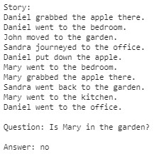
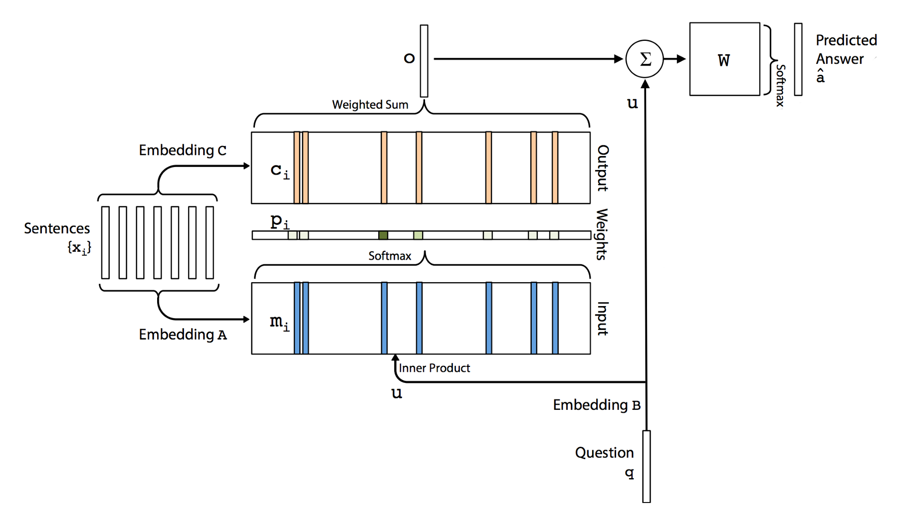
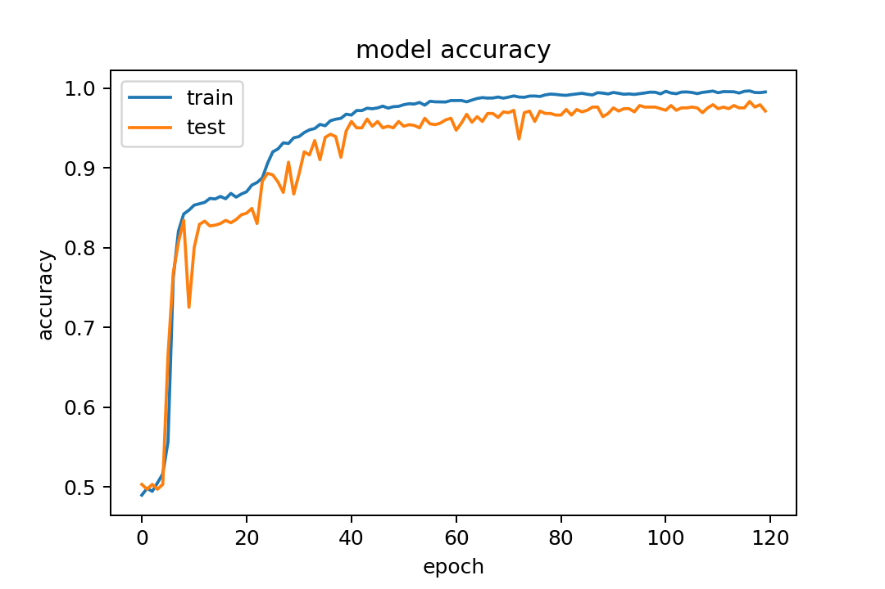

# Question-Answering-with-End-to-End-Memory-Network
Use end-to-end memory networks architecture for Question &amp; Answering NLP system

# Project objective
This project uses a end-to-end memory network architecture to build a chatbot model able to answer simple questions on a text corpus ('story'). Learning capabilities allow logical deduction on memorized corpus. The model is written in keras.

# Dataset

The project uses the bAbI dataset from Facebook Research. The dataset is available [here](https://research.fb.com/downloads/babi/). bAbI dataset is composed of several sets to support 20 tasks for testing text understanding and reasoning as part of the bAbI project. The aim is that each task tests a unique aspect of text and reasoning, and hence test different capabilities of learning models. The datasets are in english.
- Each task tests a unique aspect of learning capabilities: Dialog in the restaurant domain, children's book missing word test, Movie dialog, questions-detailed answers dataset, path or localization problems....
- For our task, there are 10,000 samples for training, and 1,000 for testing. A sample item in the set is composed of a story (several short sentences), a question and the answer to the question for training purpose. In our case, the answers are simply Yes / No answers. A sample of the dataset is show below.

# Memory Networks Architecture

This deep learning neural network architecture was published in 2015 and you can refer to the original [paper](https://arxiv.org/abs/1503.08895) for its detailed description. The architecture shares some early principles with attention model.

The model takes two different inputs: A story (represented as a list of sentences all required to answer the question) and a question. The model performs calculation in order to combine these inputs and predict the answer. We can split the network into several functions:
- Input Encoder m: This section transforms all input sentences into vectors of given embedding size and length of sentence_max_length. size: batch x sentence_max_length x embedding_size
- Input Encoder c: This section transforms all input sentences into vectors of embedding size query_max_length and length of sentence_max_length. size: batch x sentence_max_length x query_max_length.
- Question Encoder u: This section vectorizes the input question with given embedding size and query_max_length. size: batch x query_max_length x embedding_size

Calculation steps:
- Calculation input weights p: dot product between m and u followed by a softmax activation function generating weights p (batch x sentence_max_length x query_max_length)
- Response vector O with the addition of p and input Encoder c => (batch x sentence_max_length x query_max_length)
- Concatenation of Response vector O with Question Encoder u resulting into answer object of shape (samples x query_max_length x [sentence_max_length + embedding_size])
- The answer object is then passed through an LSTM layer (dimension reduction) followed by a dense layer resulting into output vector of the size of the vocabulary (output shape = samples x vocabulary_size). Finally, a sigmoid generates a probability distribution over the vocabulary size. In this project, due to the training objectives, the probability arbitrates over 2 words of the vocabulary: 'yes' and 'no'.

Memory Networks model representation:

All parameters (embeddings, weight matrix to determine predicted answer) are learned during training.
Model limitation: The whole vocabulary must be known during training phase. Only words which are part of the corpus (training and testing) can be used during inference. 

# Results

The model is trained very quickly over 120 epochs using RMSprop and lr = 0.01. Other hyperparameters: Embedding size of 128, batch size of 256. Accuracy on unseen test data reaches over 97%.

Excellent prediction on complex story.

Story:
- Daniel grabbed the apple there.
- Daniel went to the bedroom.
- John moved to the garden.
- Sandra journeyed to the office.
- Daniel put down the apple.
- Mary went to the bedroom.
- Mary grabbed the apple there.
- Sandra went back to the garden.
- Mary went to the kitchen.
- Daniel went to the office.

  - Question: Is Mary in the garden?  ==> Answer: no
  - Question: Is Mary in the kitchen?  ==> Answer: yes
  - Question: Is Mary in the bedroom?  ==> Answer: no
